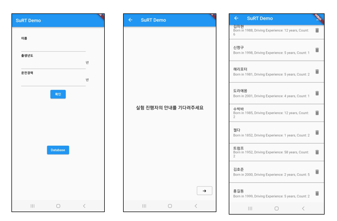
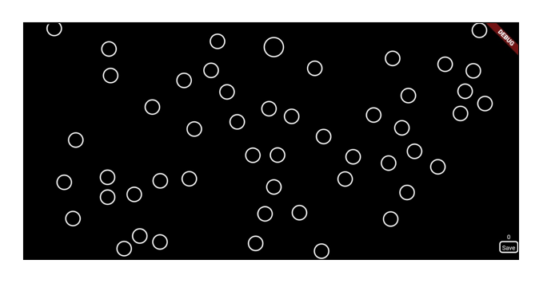

# surt

Surrogate Reference Task를 태블릿 PC에 맞게 변형한 버전입니다. 현재 제작중에 있습니다.  

원활한 실험 진행을 위해 SuRT 화면 외에도 프로필 입력 화면, SuRT 수행 횟수 기록 기능 등을 추가하였습니다.

### 메인 화면

메인 화면에서 확인 버튼을 누르면 이후 실험자가 실험을 진행할 수 있는 기능을 실행할 수 있으며 데이터베이스 버튼을 누르면 지금까지 피험자들의 기록을 확인 및 csv 파일로 다운로드 할 수 있습니다.

### SuRT 카운트 화면

메인 화면에서 확인 버튼을 누른 후 실험을 시작하면 실행되는 화면입니다. 크기가 다른 원을 찾아 누르면 화면이 매번 바뀌며 오른쪽 하단의 save 버튼을 오래 누르면 실험이 종료됩니다.  

실험이 종료된 후에는 데이터베이스 기능을 통해 해당 피험자가 SuRT를 몇번 수행했는지 확인할 수 있습니다.

---

Mattes, Stefan, and Anders Hallén. "Surrogate distraction measurement techniques: The lane change test." Driver distraction: Theory, effects, and mitigation (2009): 107-121.
